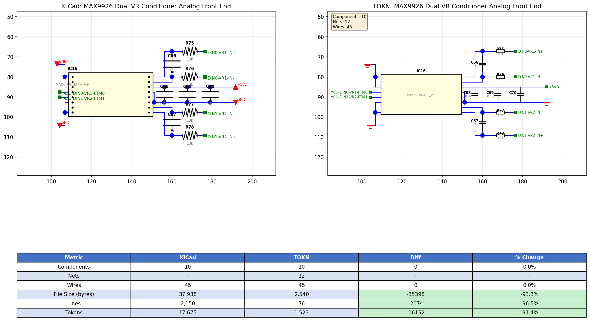

# TOKN

**Token-Optimised KiCad Notation** — a compact format for representing KiCad schematics, designed for LLM training and generation.

## What is TOKN?

TOKN converts KiCad schematic files (`.kicad_sch`) into a token-efficient representation, achieving **>92% token reduction** while preserving electrical connectivity, component positions, and wire geometry. It's built on [TOON](https://github.com/toon-format/spec) (Token-Oriented Object Notation).



### Results

| Metric | KiCad | TOKN | Reduction |
|--------|-------|------|-----------|
| File Size | 83,834 bytes | 5,077 bytes | **-93.9%** |
| Lines | 4,535 | 143 | **-96.8%** |
| Tokens | 38,678 | 3,027 | **-92.2%** |

### Goals

- **Minimise tokens** — strip UUIDs, graphics, structural noise
- **Preserve design intent** — component types, values, positions, connectivity
- **Preserve layout** — wire geometry for schematic reconstruction
- **Enable round-trip conversion** — `kicad_sch → TOKN → kicad_sch`
- **Be learnable** — consistent structure for LLM pattern learning

## Format

TOKN v1.1 includes three sections:

```toon
# TOKN v1
title: MAX9926 Dual VR Conditioner

components[10]{ref,type,value,fp,x,y,w,h,a}:
  C66,C,1n,,160.02,73.66,0.00,7.62,0
  IC16,MAX9926UAEE_V+,MAX9926UAEE_V+,SOP65P602X175-16N,129.54,88.90,38.10,17.78,0
  R75,R,10k,0603,168.91,67.31,7.62,0.00,90

nets[12]{name,pins}:
  +5VD,"C68.1,C69.1,C70.1,IC16.14"
  GND,"C68.2,C69.2,C70.2,IC16.1,IC16.3"
  DIN0-VR1-IN+,R75.2

wires[45]{net,pts}:
  +5VD,"156.21 85.09,167.64 85.09"
  +5VD,"167.64 85.09,179.07 85.09"
```

### Component Fields

| Field | Description |
|-------|-------------|
| `ref` | Reference designator (R1, C1, U1) |
| `type` | Normalised type (R, C, CP, LED, MCP2551, etc.) |
| `value` | Component value or part number |
| `fp` | Footprint shorthand (0603, SOIC-8, etc.) |
| `x,y` | Center position (mm) |
| `w,h` | Pin spread dimensions (mm) |
| `a` | Rotation angle (0, 90, 180, 270) |

## Usage

### Convert KiCad to TOKN

```bash
python src/tokn_encoder.py schematic.kicad_sch output.tokn
```

### Convert TOKN back to KiCad (experimental)

```bash
python src/tokn_decoder.py output.tokn output.kicad_sch
```

Note: The decoder is experimental. It generates valid KiCad schematics but uses simplified symbol representations (rectangles for ICs). See [docs/kicad-schematic-generation.md](docs/kicad-schematic-generation.md) for technical details.

### Render Comparison

```bash
python src/render.py --compare schematic.kicad_sch output.tokn comparison.png
```

### Parse TOKN

```bash
python src/tokn_parser.py output.tokn
```

## Known Issues

- **Component rotation**: Some passive components (R, C) may render with incorrect orientation in the preview. The rotation angle is stored correctly but the renderer doesn't always interpret it properly for all symbol orientations.

## Project Structure

```
tokn/
├── spec/
│   └── TOKN-v1.md          # Format specification
├── docs/
│   └── kicad-schematic-generation.md  # Research on KiCad file generation
├── src/
│   ├── kicad_sch.py        # KiCad schematic parser
│   ├── connectivity.py     # Net/connectivity analyzer
│   ├── tokn_encoder.py     # KiCad → TOKN converter
│   ├── tokn_parser.py      # TOKN parser
│   ├── tokn_decoder.py     # TOKN → KiCad converter (experimental)
│   └── render.py           # Schematic renderer
└── examples/
    ├── mcp2551-can-transceiver/
    ├── max232-uart-rs232/
    ├── max9926-vr-conditioner/
    ├── 4-channel-current-source/
    └── tpic8101-knock-sensor/
```

## Related

- [TOON Specification](https://github.com/toon-format/spec)
- [KiCad](https://www.kicad.org/)

## License

[MIT](LICENSE)
